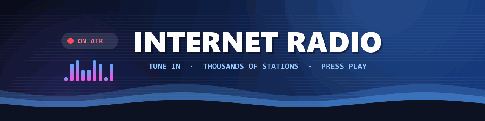
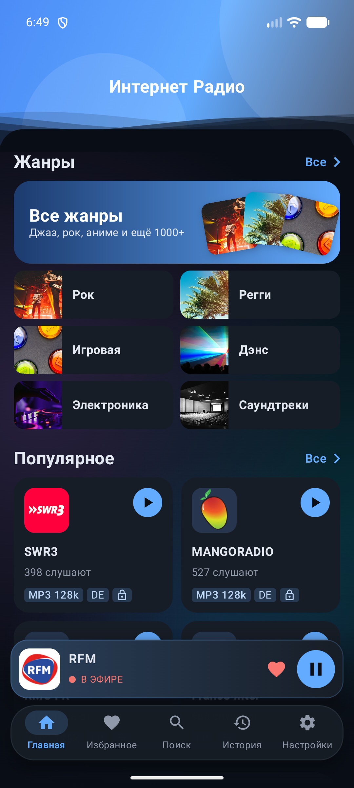
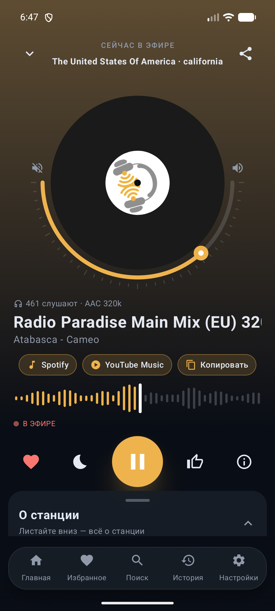
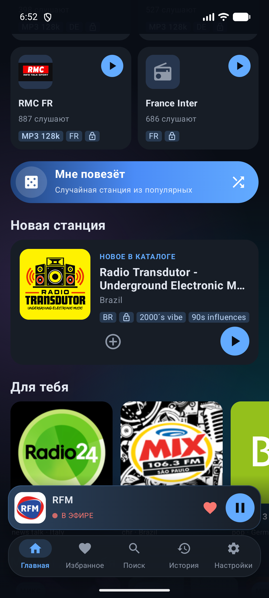
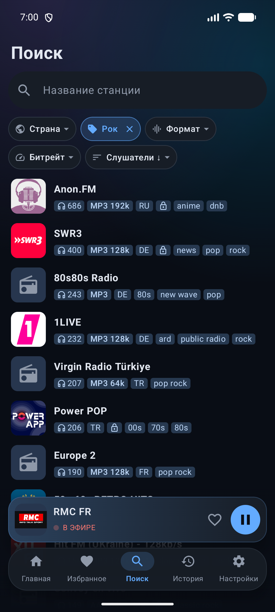
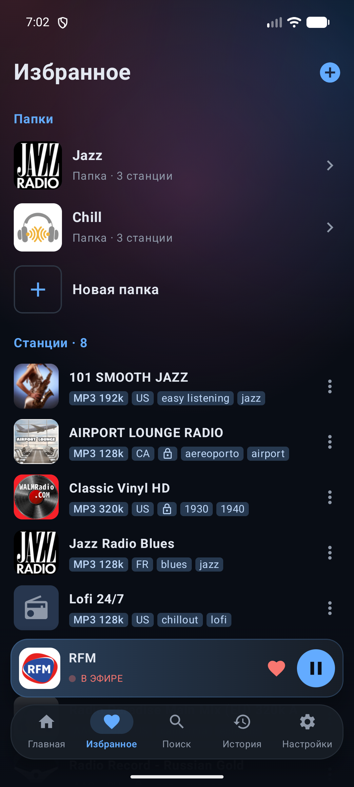
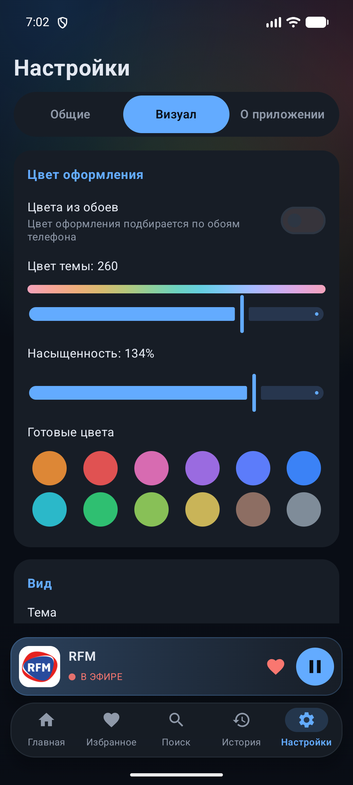

<!-- ╔══════════════════════════════════════════════════════════════╗ -->
<!--               INTERNET RADIO · ON AIR EDITION                    -->
<!-- ╚══════════════════════════════════════════════════════════════╝ -->

<div align="center">



<br>

[](#)
[](https://kotlinlang.org/)
[](https://developer.android.com/compose)
[](https://developer.android.com/media/media3)
[](LICENSE)

[](https://www.rustore.ru/catalog/app/com.tohn95.internetradio)
[](https://github.com/bboyJohnn/InternetRadio/releases/latest)

### ▚▚▚  TUNE IN · PRESS PLAY  ▚▚▚

**Thousands of radio stations from all over the world — in one clean, ad-free Android app.**
Genres, collections, smart search, favorites with folders and background playback.

</div>

```
┌──────────────────────────────────────────────────────────────────────┐
│  > PICK A VIBE ........... genres · moods · decades · world radio      │
│  > PRESS PLAY ............ plays in the background, even on lock screen│
│  > SAVE IT ............... ♡ favorites, folders, history               │
└──────────────────────────────────────────────────────────────────────┘
```

---

## ◆ SCREENS

<div align="center">

|  HOME  |  PLAYER  |  DISCOVER  |
|:------:|:--------:|:----------:|
|  |  |  |
|  **SEARCH**  |  **FAVORITES**  |  **SETTINGS**  |
|  |  |  |

</div>

The player **recolors itself to match the station logo**, shows what is playing right now and
lets you jump straight to the track in **Spotify** or **YouTube Music** — or just copy its name.

---

## ◆ FEATURES · FULL ROSTER

```
╔═══════════════════════════════════════════════════════════════════════╗
║  DISCOVER                                                             ║
╟───────────────────────────────────────────────────────────────────────╢
║  ▸ Home ................ genres, popular, new station, "For you",     ║
║                          trending chart, on air in your country       ║
║  ▸ Collections ......... I'm feeling lucky · mixes · moods · decades   ║
║  ▸ World radio ......... flags of the biggest radio countries          ║
║  ▸ Smart search ........ country · genre · format · bitrate · sort     ║
║  ▸ Lists ............... sort by listeners or A–Z, search inside       ║
╠═══════════════════════════════════════════════════════════════════════╣
║  PLAYER                                                               ║
╟───────────────────────────────────────────────────────────────────────╢
║  ▸ Now playing ......... live track title from the stream (ICY)       ║
║  ▸ Station colors ...... background & accents taken from the logo     ║
║  ▸ Volume arc .......... drag around the spinning vinyl               ║
║  ▸ Track actions ....... Spotify · YouTube Music · copy · 👍 vote      ║
║  ▸ Sleep timer ......... soft fade-out, then pause                    ║
║  ▸ Station info ........ codec, bitrate, votes, homepage, share       ║
╠═══════════════════════════════════════════════════════════════════════╣
║  ALWAYS ON AIR                                                        ║
╟───────────────────────────────────────────────────────────────────────╢
║  ▸ Background playback . styled notification with ♡ and ⏮ ⏭          ║
║  ▸ Auto-reconnect ...... resumes by itself when the network is back   ║
║  ▸ Live edge ........... after a long pause you hear what's on now    ║
║  ▸ Headphones out ...... pauses instead of blasting the speaker       ║
║  ▸ Home-screen widget .. station name + play / pause                  ║
╠═══════════════════════════════════════════════════════════════════════╣
║  YOUR LIBRARY                                                         ║
╟───────────────────────────────────────────────────────────────────────╢
║  ▸ Favorites ........... folders like playlists, one station in many  ║
║  ▸ Custom station ...... add any stream by its URL                     ║
║  ▸ Find logo ........... pick a logo from the station's website       ║
║  ▸ History ............. grouped by day, with search                  ║
╠═══════════════════════════════════════════════════════════════════════╣
║  LOOK & FEEL                                                          ║
╟───────────────────────────────────────────────────────────────────────╢
║  ▸ Live theme .......... any hue (OKLCH) + saturation, 12 presets     ║
║  ▸ Modes ............... light · dark · system · true black (OLED)    ║
║  ▸ Material You ........ colors from your wallpaper (Android 12+)     ║
║  ▸ Motion .............. animated waves & soft ambient backgrounds   ║
║  ▸ 17 languages ........ EN RU DE FR ES PT IT PL TR NL AR HI ID VI    ║
║                          JA KO ZH · right-to-left for Arabic          ║
╚═══════════════════════════════════════════════════════════════════════╝
```

> No ads, no sign-up, no tracking. Does not need Google services — works on any Android 8.0+ device.

---

## ◆ SELECT LEVEL · WHERE TO GET IT

| CARTRIDGE | WHAT | FOR WHOM |
|-----------|------|----------|
| 🛒 [**RuStore**](https://www.rustore.ru/catalog/app/com.tohn95.internetradio) | store version with auto-updates | **Recommended** |
| 📦 [**APK from Releases**](https://github.com/bboyJohnn/InternetRadio/releases/latest) | the same signed build | install by hand, no store needed |

> Installing the APK by hand: allow "Install unknown apps" for your browser or file manager when Android asks.

---

## ◆ BOOT SEQUENCE · BUILD FROM SOURCE

```console
$ git clone https://github.com/bboyJohnn/InternetRadio.git
$ cd InternetRadio
$ ./gradlew assembleDebug          # Windows: gradlew.bat assembleDebug

  [ OK ] Kotlin 2.3 · AGP 9 · JDK 17+ (the JBR bundled with Android Studio is fine)
  [ OK ] Android SDK 36 · minSdk 26
  [ >> ] app/build/outputs/apk/debug/app-debug.apk
  [ OK ] ready. install it and PRESS PLAY.
```

```console
$ ./gradlew testDebugUnitTest      # unit tests
$ ./gradlew lintDebug              # Android lint
```

> **Release build** (`./gradlew assembleRelease`) is signed with your own key from `keystore.properties`
> in the project root — `storeFile`, `storePassword`, `keyAlias`, `keyPassword`. The file is ignored by git;
> without it the release build falls back to the debug key.

---

## ◆ ENGINE ROOM · TECH STACK

| PART | WHAT |
|------|------|
| **UI** | Kotlin · Jetpack Compose · Material 3 · custom OKLCH theme engine |
| **Audio** | AndroidX Media3 (ExoPlayer + MediaSession), HLS, ICY metadata |
| **Data** | [radio-browser.info](https://www.radio-browser.info/) API · Retrofit · OkHttp · kotlinx.serialization |
| **Storage** | Room (favorites, folders, history, offline cache) · DataStore |
| **Images** | Coil 3 · AndroidX Palette (colors from logos) |
| **Wiring** | Hilt · Navigation Compose · Glance (widget) · AppCompat per-app language |

---

## ◆ MEMORY MAP · REPO LAYOUT

```
app/src/main/java/com/tohn95/internetradio/
  data/            > radio-browser client, Room database, repository, logo finder
  playback/        > Media3 service, player controller, reconnect, sleep timer
  ui/              > Compose screens: home, search, player, favorites, history, settings
  ui/theme/        > OKLCH palette + live theme
  widget/          > Glance home-screen widget
app/src/main/res/  > 17 translations (values-*), icons, genre pictures, widget
app/src/test/      > unit tests (reconnect, sleep timer, metadata, API client, theme)
docs/              > README art: banner + screenshots
```

---

## ◆ CREDITS

- 📻 Station catalog — [radio-browser.info](https://www.radio-browser.info/), the open community radio database
- 🖼 Genre pictures — CC0 photos via [Openverse](https://openverse.org/), list in [docs/genre-images-credits.txt](docs/genre-images-credits.txt)
- 🎧 Streams belong to their radio stations; the app only plays their public links
- 🐛 Found a bug? — open an [Issue](https://github.com/bboyJohnn/InternetRadio/issues)

---

<div align="center">

### ▚▚▚  SIGNAL LOST?  NO — STILL ON AIR ▸ ▸ ▸  ▚▚▚

Made with 📻 &nbsp;·&nbsp; Powered by [radio-browser](https://www.radio-browser.info/) · [Media3](https://developer.android.com/media/media3) · [Jetpack Compose](https://developer.android.com/compose)

[](https://github.com/bboyJohnn/InternetRadio)

</div>
